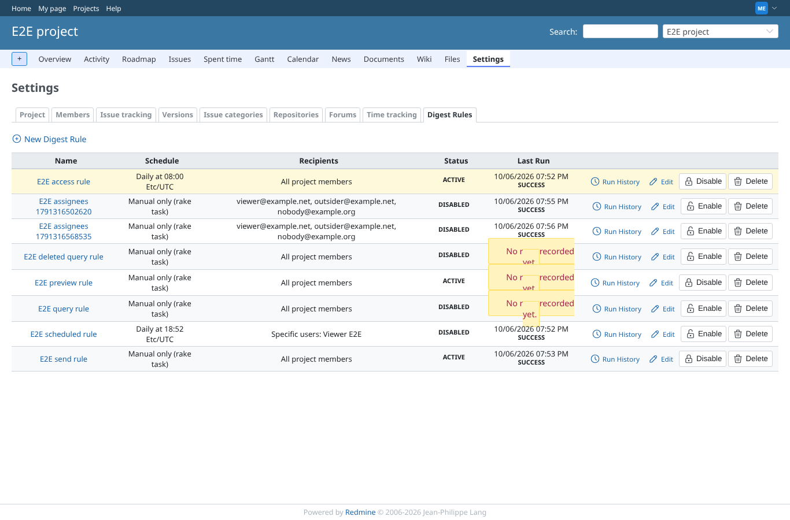
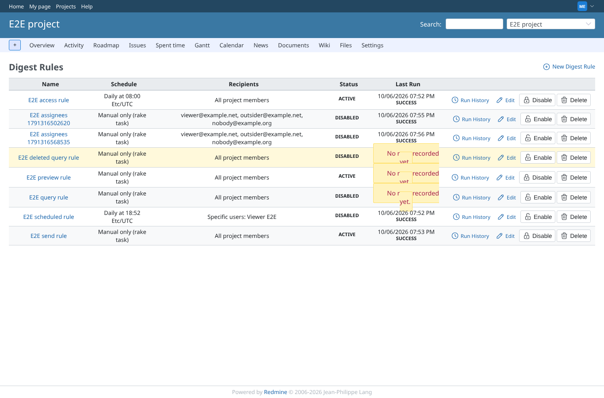
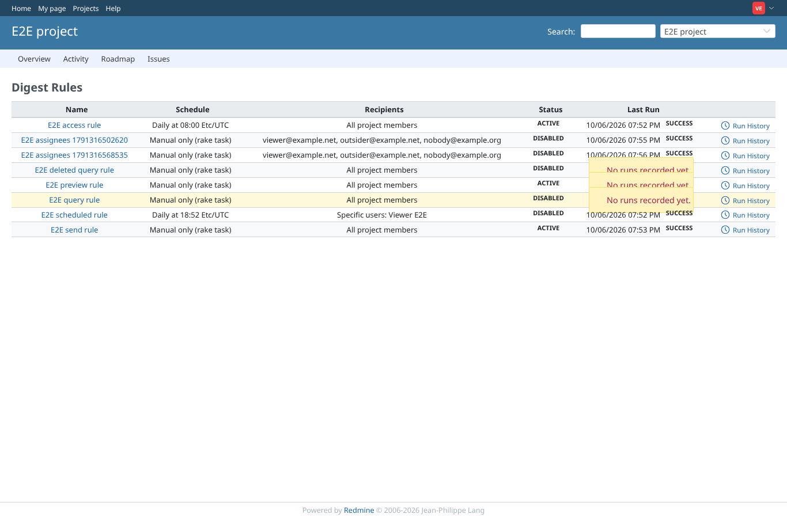
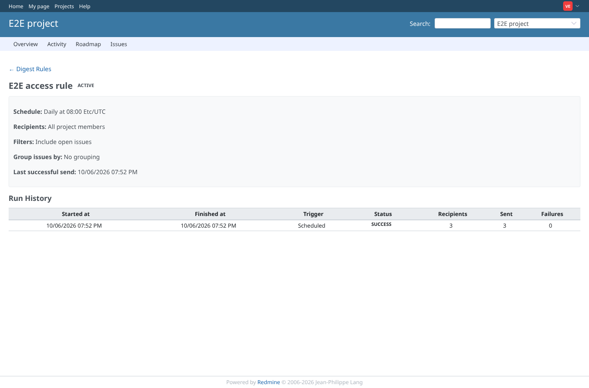
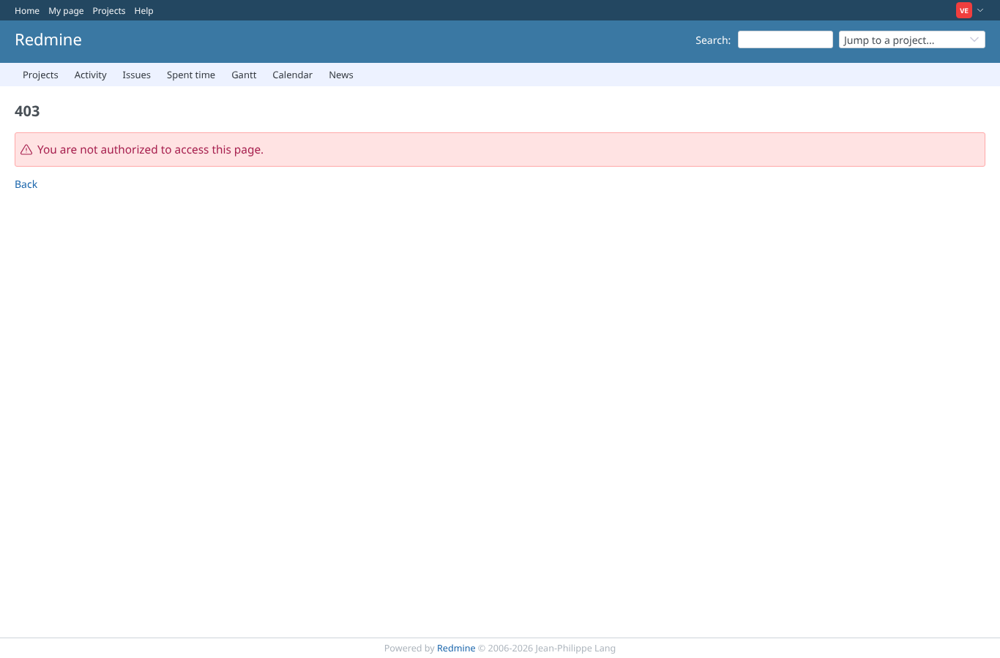
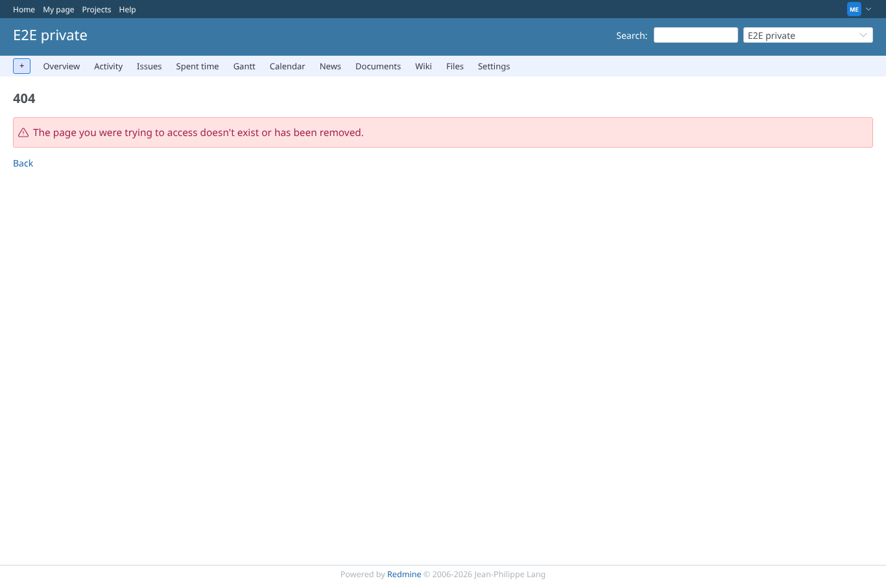

# access

Run 2026-10-06T19:58:05.456Z against http://127.0.0.1:3000.

| screenshot | user | URL | shows |
|---|---|---|---|
|  | manager | `/projects/e2e-project/settings/digest_rules` | manager: the Digest rules tab with New, Run history, Edit, Disable, Delete, each with its icon |
|  | manager | `/projects/e2e-project/digest_rules` | manager: the rule list page with the New digest rule link |
|  | viewer | `/projects/e2e-project/digest_rules` | viewer (view only): the rule list with the Run history link, no New/Edit/Disable/Delete |
|  | viewer | `/projects/e2e-project/digest_rules/1` | viewer: the rule page without Preview, Edit, Disable or Delete |
|  | viewer | `/projects/e2e-project/digest_rules/1/edit` | viewer: the new rule form is refused (403) |
|  | reporter | `/projects/e2e-project/digest_rules` | reporter (no plugin permission): the rule list is refused (403) |
|  | outsider | `/projects/e2e-private/digest_rules` | outsider: the rules of the private project are refused (403) |
|  | anonymous | `/login?back_url=http%3A%2F%2F127.0.0.1%3A3000%2Fprojects%2Fe2e-project%2Fdigest_rules` | anonymous: sent to the login page |
|  | manager | `/projects/e2e-private/digest_rules/1` | manager: a rule of e2e-project opened under e2e-private is not found (404) |
|  | manager | `/projects/e2e-project/digest_rules` | module Issue digests switched off: the rule list is refused (403), also to the manager |
