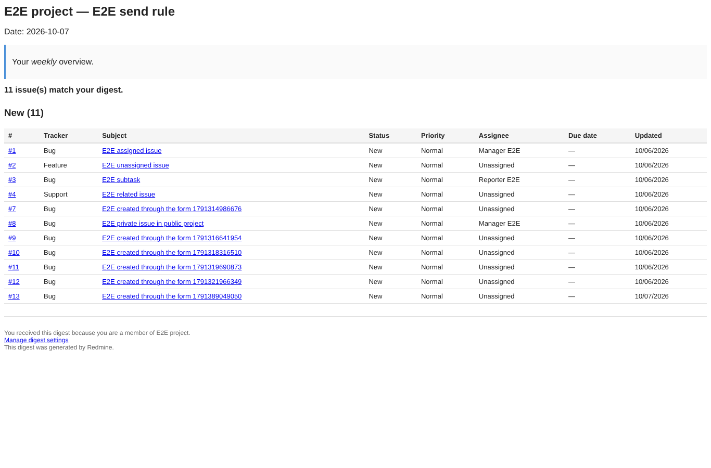
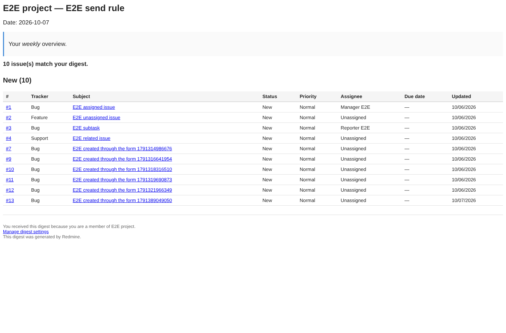
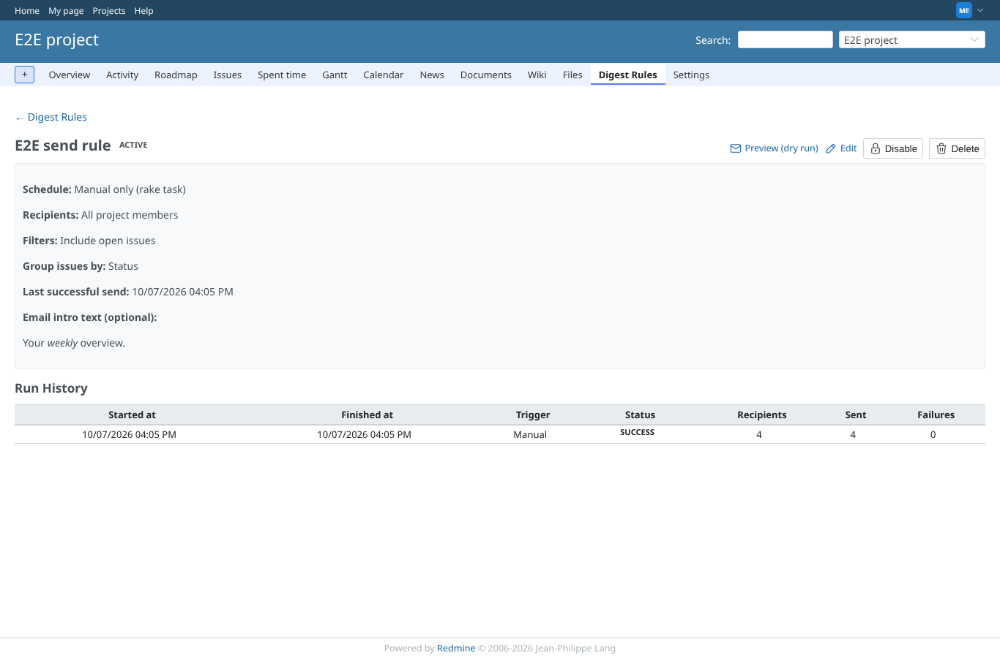
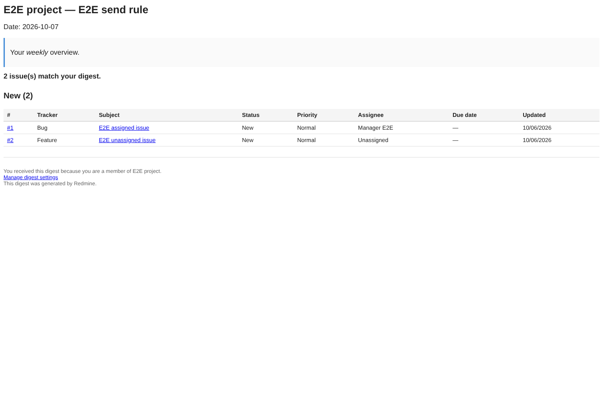

# digest-send

Run 2026-10-07T16:06:25.900Z against http://127.0.0.1:3000.

| screenshot | user | URL | shows |
|---|---|---|---|
|  | manager | `/my/page` | The manager's digest as a mail client renders it, subject "E2E digest 1791389098434 E2E project: 11 issues": grouped by status, the private issue included |
|  | manager | `/my/page` | The reporter's digest of the same run: the private issue is not in it |
|  | manager | `/projects/e2e-project/digest_rules/4` | The rule page lists the manual run: trigger, status, recipients, mails sent |
|  | manager | `/projects/e2e-project/digest_rules/4` | With "Maximum issues per email" set to 2 the digest lists 2 issues |
