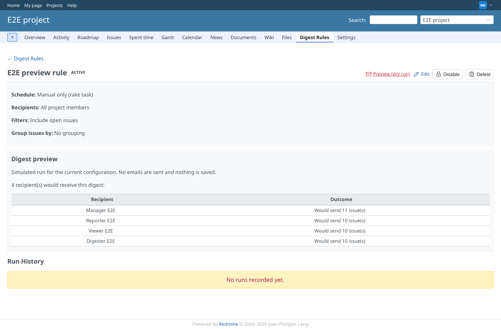
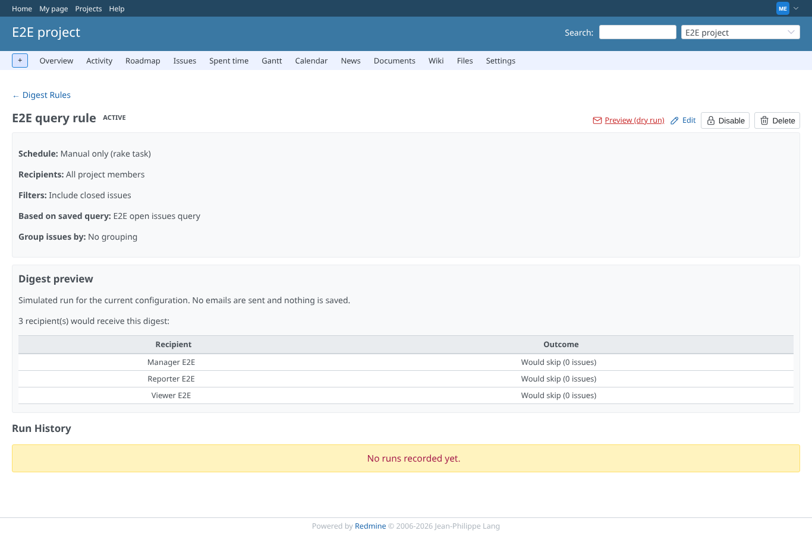
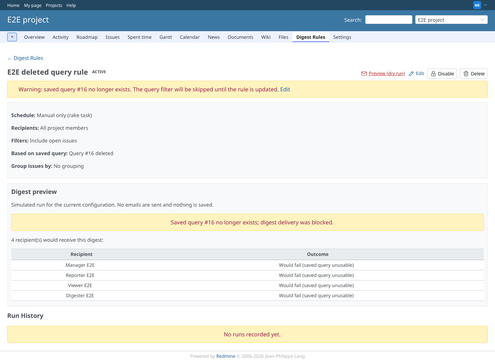
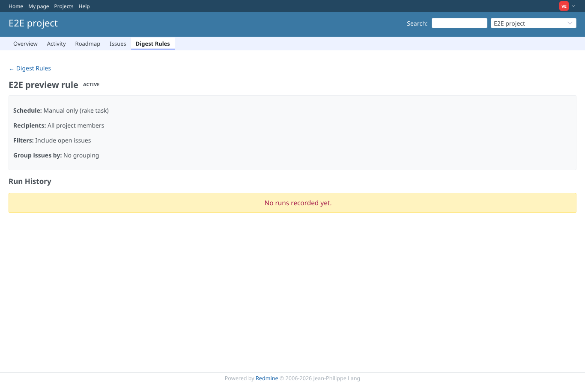

# preview

Run 2026-10-07T16:07:09.758Z against http://127.0.0.1:3000.

| screenshot | user | URL | shows |
|---|---|---|---|
|  | manager | `/projects/e2e-project/digest_rules/6` | Dry run per recipient, counts only: Manager E2E Would send 11 issue(s); Reporter E2E Would send 10 issue(s); Viewer E2E Would send 10 issue(s); Digester E2E Would send 10 issue(s) |
|  | manager | `/projects/e2e-project/digest_rules/7` | Closed issues AND the saved query "open issues": nothing matches, every recipient would be skipped (send empty is off) |
|  | manager | `/projects/e2e-project/digest_rules/8` | The saved query was deleted: a warning on the page and the dry run says every recipient would fail, nothing is sent |
|  | viewer | `/projects/e2e-project/digest_rules/6` | viewer: no Preview button; a forged POST to preview is refused (403) |
