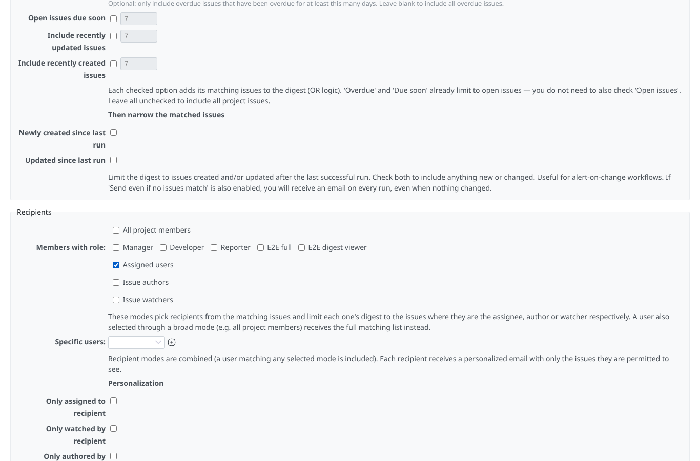
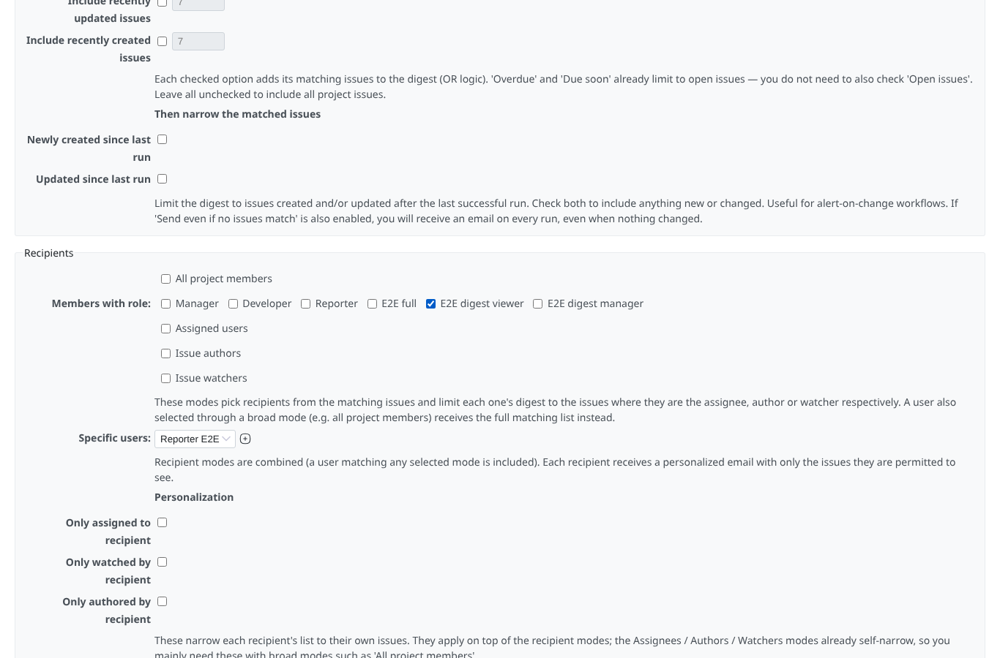
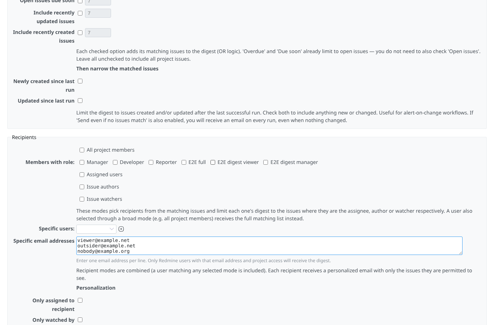
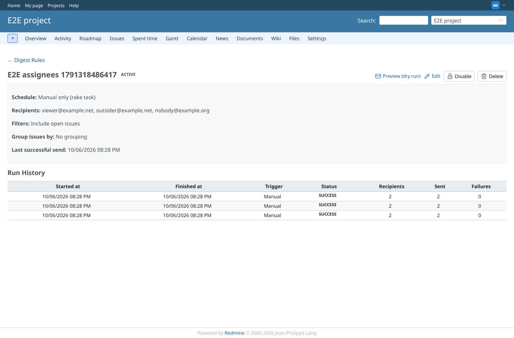

# recipients

Run 2026-10-06T20:28:54.181Z against http://127.0.0.1:3000.

| screenshot | user | URL | shows |
|---|---|---|---|
|  | manager | `/projects/e2e-project/digest_rules/new` | Recipients: issue assignees only |
|  | manager | `/projects/e2e-project/digest_rules/13/edit` | Recipients: role "E2E digest viewer" and the specific user Reporter E2E |
|  | manager | `/projects/e2e-project/digest_rules/13/edit` | Recipients by e-mail address: a member, a non-member and an unknown address |
|  | manager | `/projects/e2e-project/digest_rules/13` | The rule lists the addresses; viewer and outsider (public project) received the digest, the unknown address nothing |
