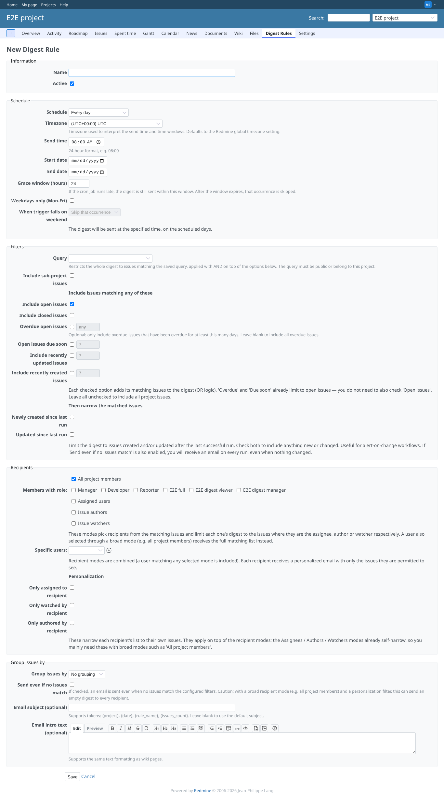
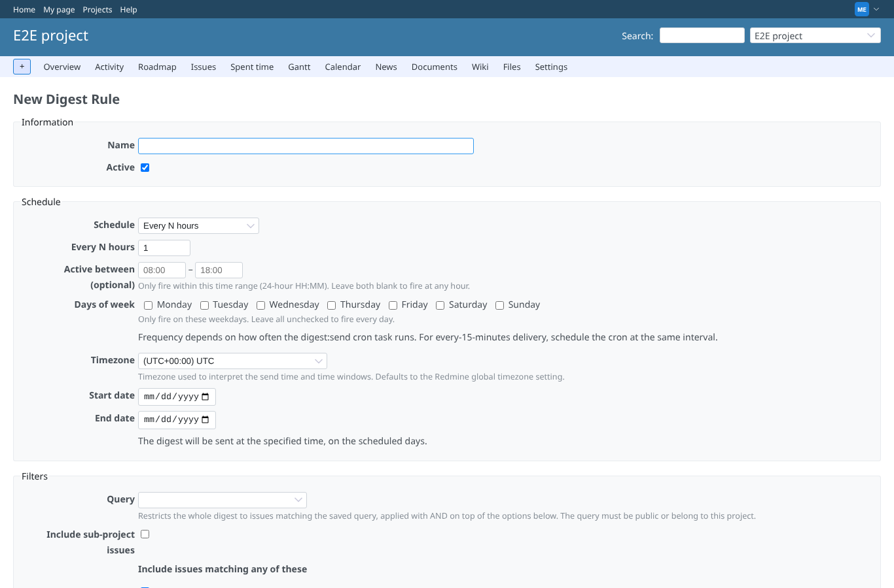
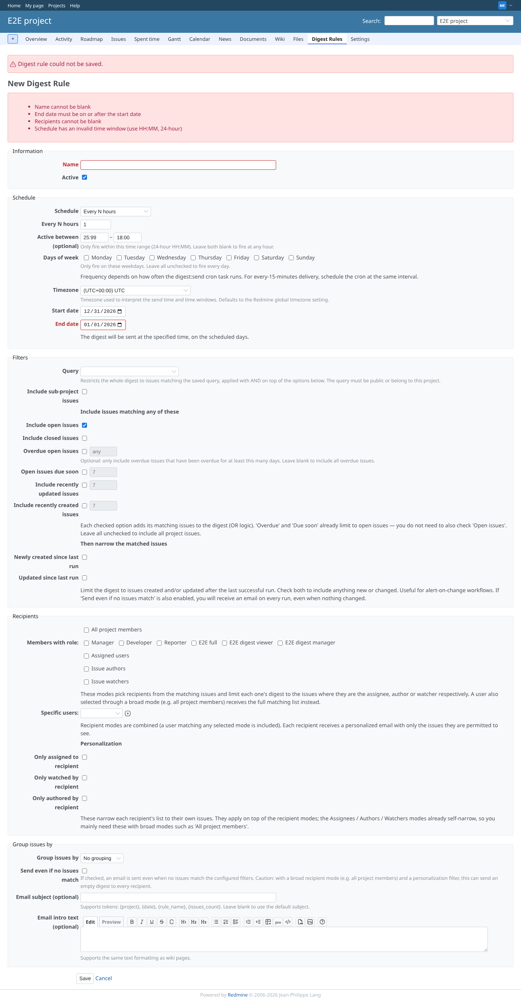
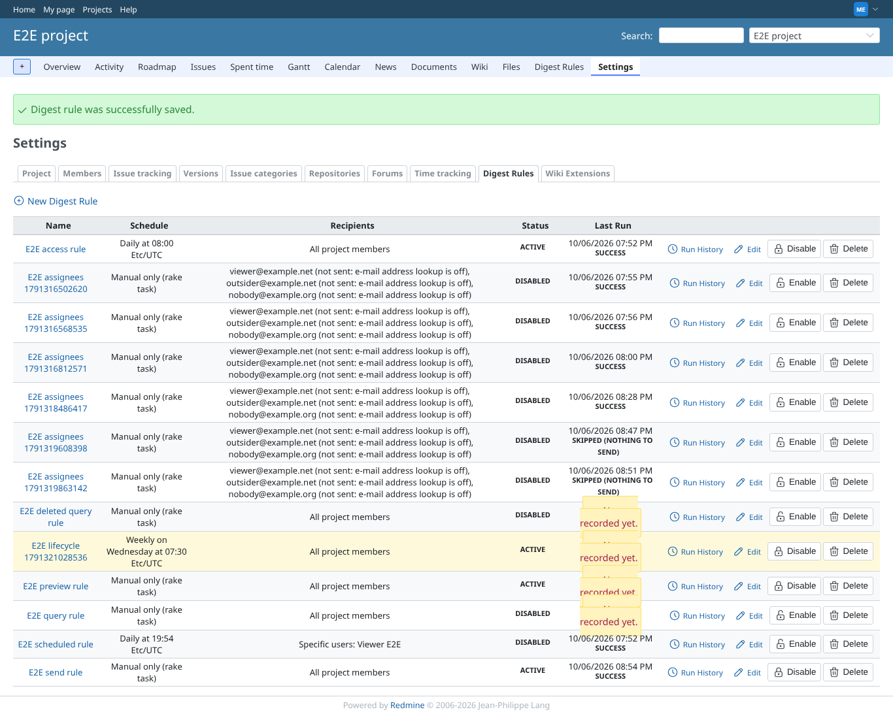
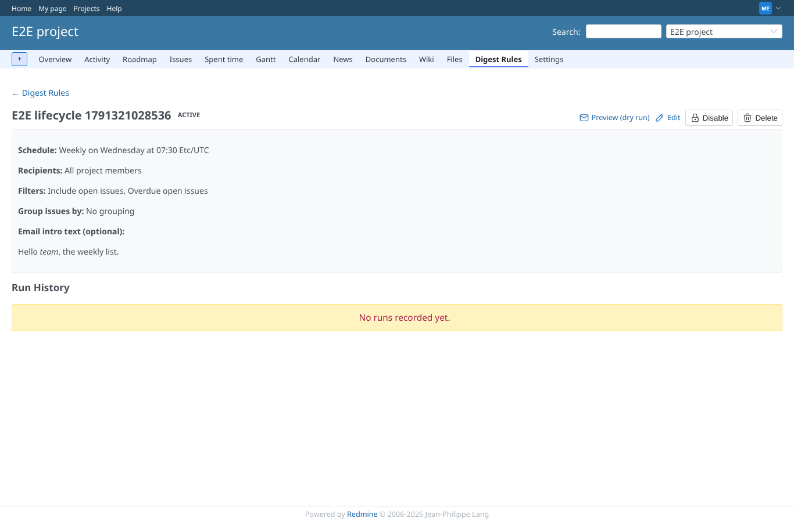
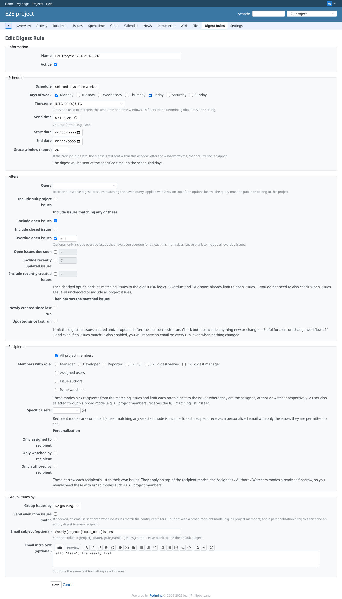
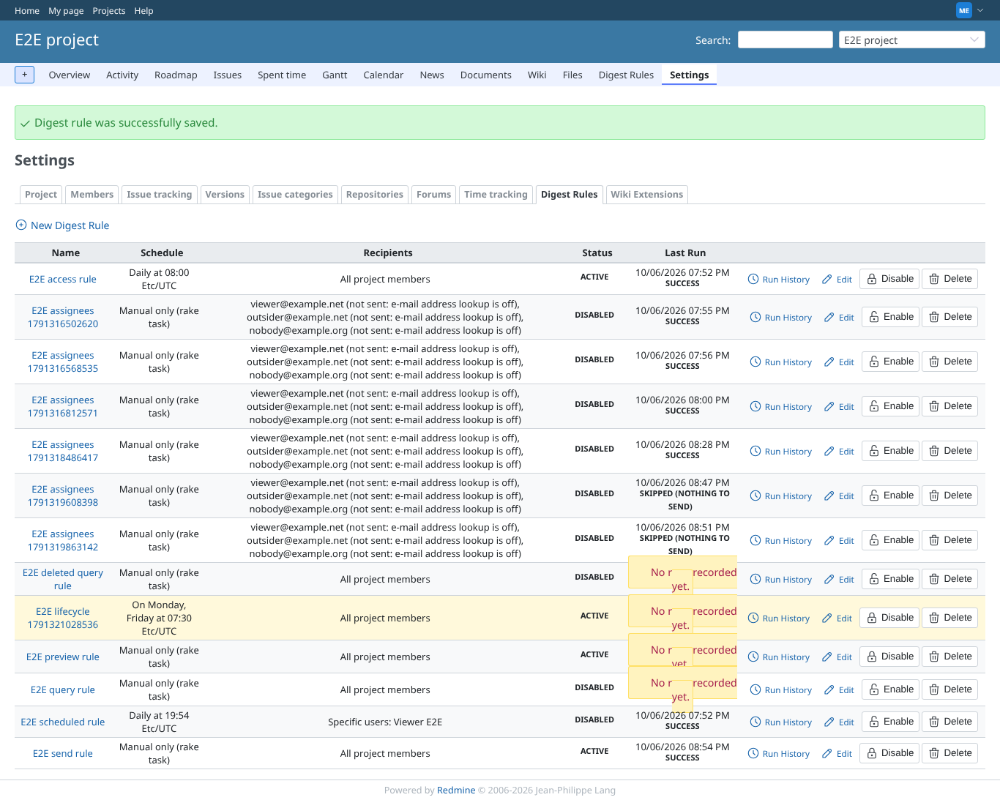
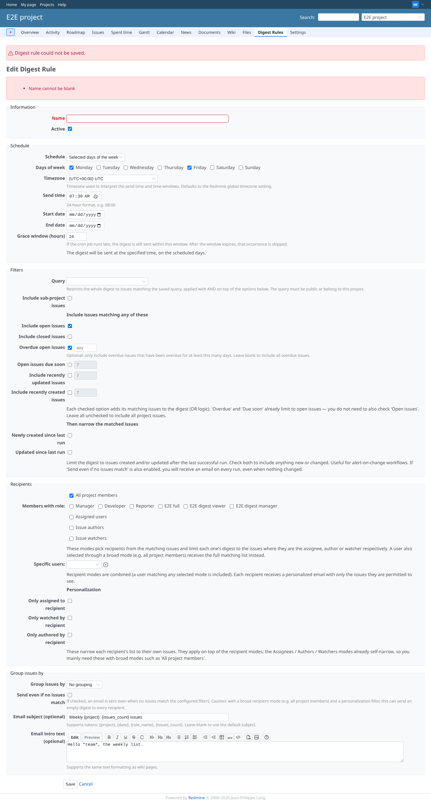
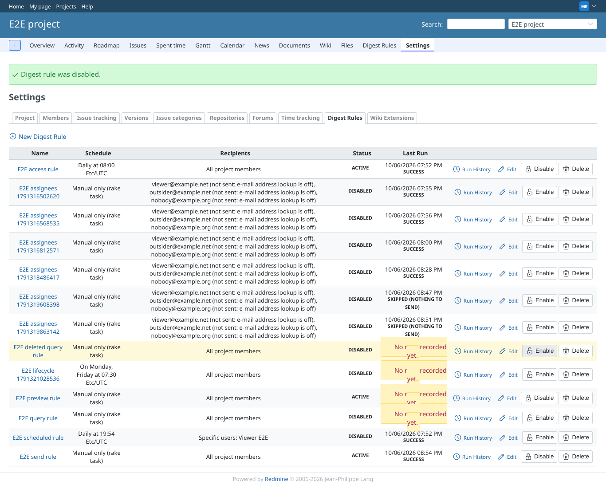
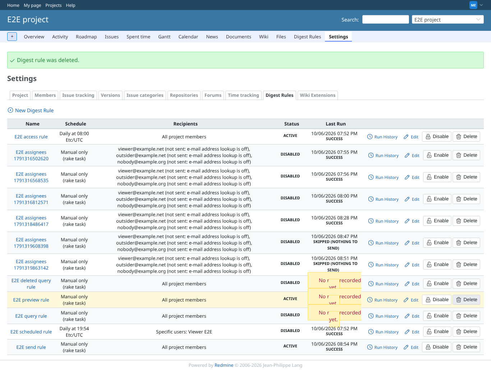

# rule-lifecycle

Run 2026-10-06T21:10:42.830Z against http://127.0.0.1:3000.

| screenshot | user | URL | shows |
|---|---|---|---|
|  | manager | `/projects/e2e-project/digest_rules/new` | New rule form: daily, 08:00, timezone UTC preselected (Redmine default time zone unset), all project members |
|  | manager | `/projects/e2e-project/digest_rules/new` | Schedule "every N hours": interval, time window and days shown, send time hidden |
|  | manager | `/projects/e2e-project/digest_rules` | Invalid input is refused and explained: 4 errors (name, recipients, end date, time window) |
|  | manager | `/projects/e2e-project/settings/digest_rules` | Saved: notice, the rule is listed as "Weekly on Wednesday at 07:30 Etc/UTC" |
|  | manager | `/projects/e2e-project/digest_rules/18` | The rule page: schedule, recipients, filters, formatted intro, empty run history |
|  | manager | `/projects/e2e-project/digest_rules/18/edit` | Edit form: switched to selected weekdays, Monday and Friday |
|  | manager | `/projects/e2e-project/settings/digest_rules` | Updated: the rule now reads "On Monday, Friday at 07:30 Etc/UTC" |
|  | manager | `/projects/e2e-project/digest_rules/18` | An edit with an empty name is refused; the rule keeps its name |
|  | manager | `/projects/e2e-project/settings/digest_rules` | Disabled: notice, status inactive, the button now reads Enable |
|  | manager | `/projects/e2e-project/settings/digest_rules` | Deleted after confirming (a cancelled confirmation kept it): notice, the rule is gone |
