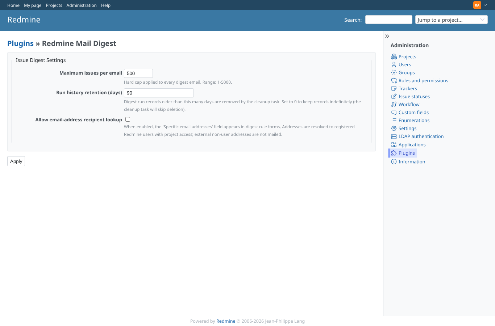
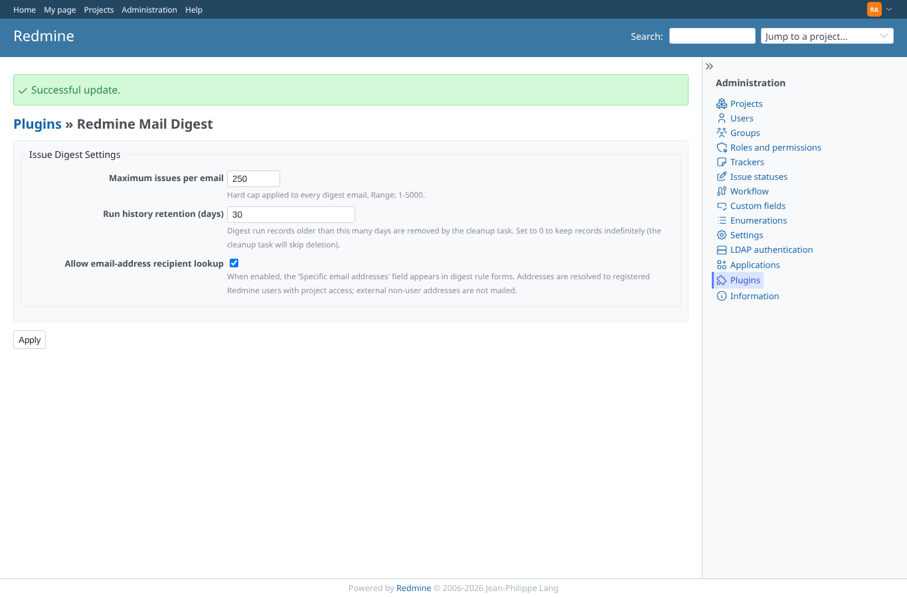
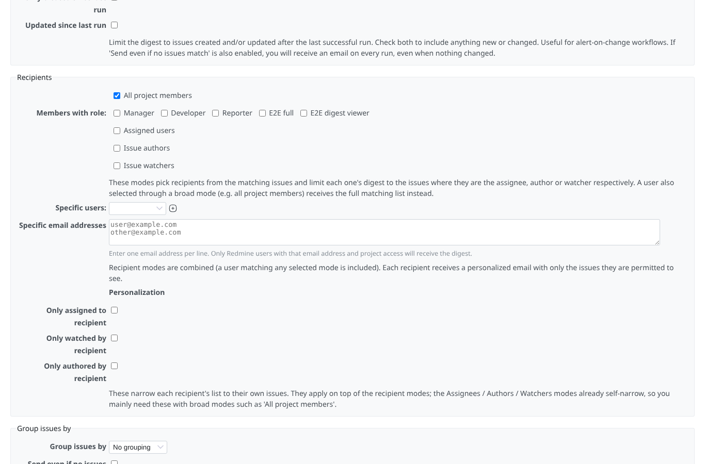

# settings

Run 2026-10-06T20:01:22.844Z against http://127.0.0.1:3000.

| screenshot | user | URL | shows |
|---|---|---|---|
|  | admin | `/settings/plugin/redmine_mail_digest` | The plugin settings: max issues per e-mail, run history retention, e-mail address lookup |
|  | admin | `/settings/plugin/redmine_mail_digest` | Saved: notice shown, the new values are kept |
|  | admin | `/projects/e2e-project/digest_rules/new` | With the e-mail address lookup on, the rule form offers the address field |
|  | reporter | `/settings/plugin/redmine_mail_digest` | A non-administrator (reporter) is refused the plugin settings (403) |
|  | anonymous | `/login?back_url=http%3A%2F%2F127.0.0.1%3A3000%2Fsettings%2Fplugin%2Fredmine_mail_digest` | Anonymous is sent to the login page |
