# smoke

Run 2026-10-06T20:48:08.554Z against http://127.0.0.1:3000.

| screenshot | user | URL | shows |
|---|---|---|---|
|  | admin | `/` | / (HTTP 200) |
| 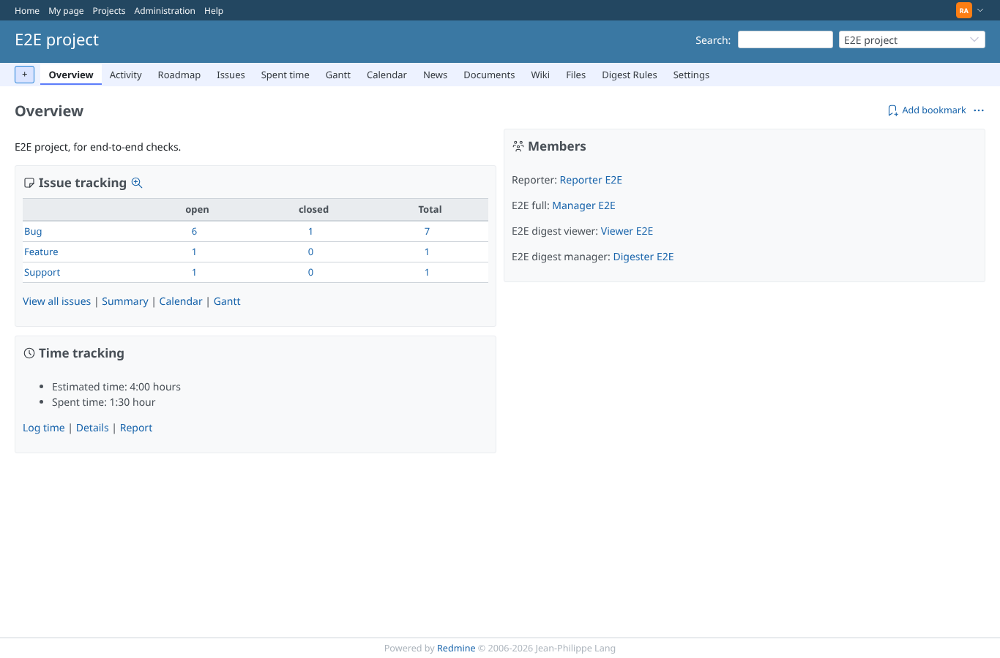 | admin | `/projects/e2e-project` | /projects/e2e-project (HTTP 200) |
| 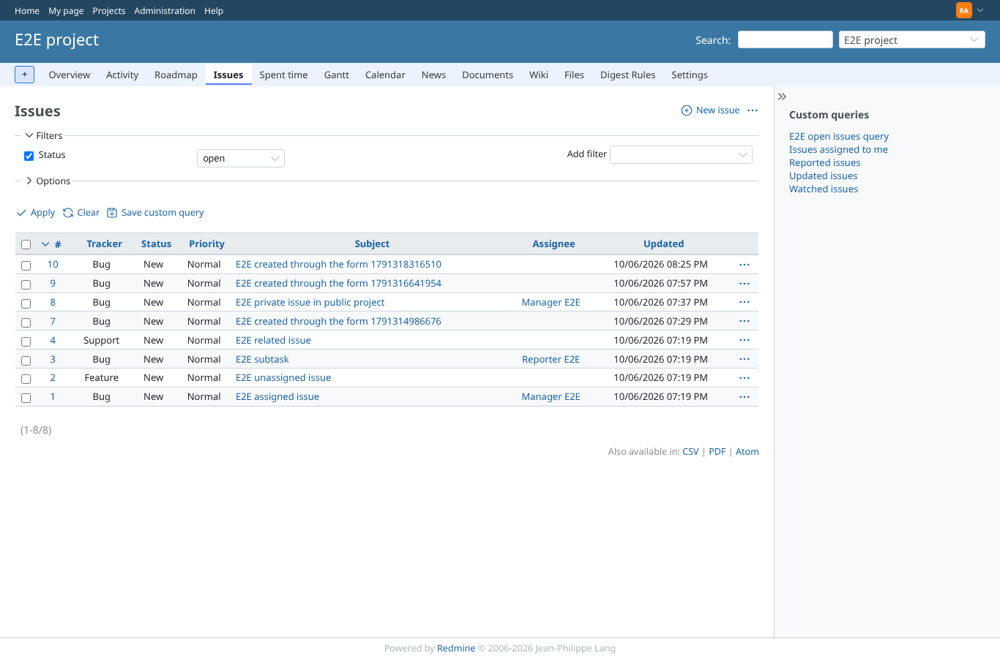 | admin | `/projects/e2e-project/issues` | /projects/e2e-project/issues (HTTP 200) |
| 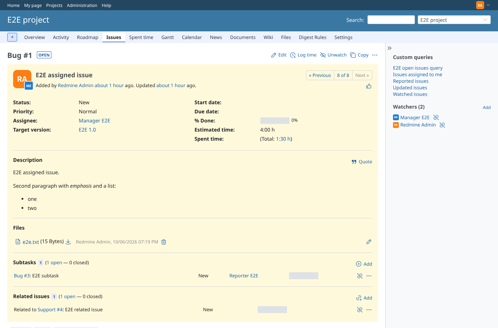 | admin | `/issues/1` | /issues/1 (HTTP 200) |
| 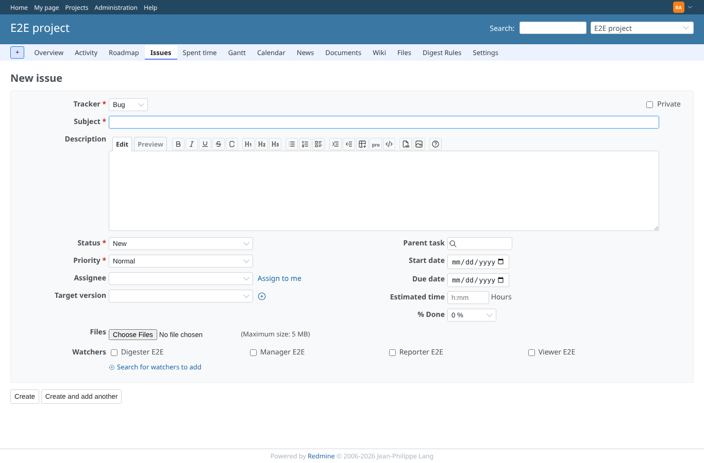 | admin | `/projects/e2e-project/issues/new` | /projects/e2e-project/issues/new (HTTP 200) |
| 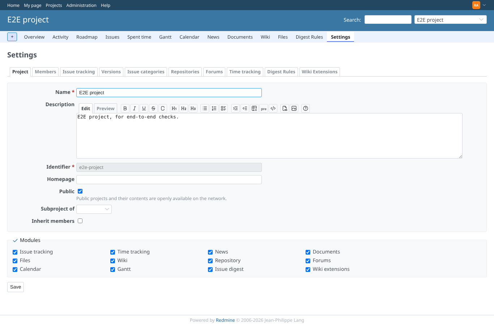 | admin | `/projects/e2e-project/settings` | /projects/e2e-project/settings (HTTP 200) |
| 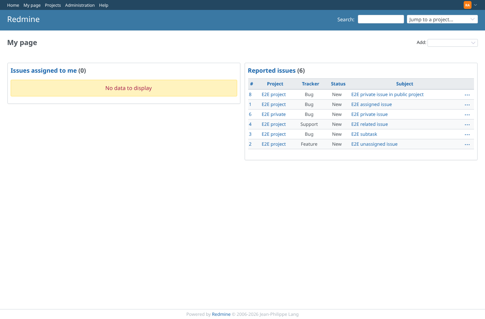 | admin | `/my/page` | /my/page (HTTP 200) |
| 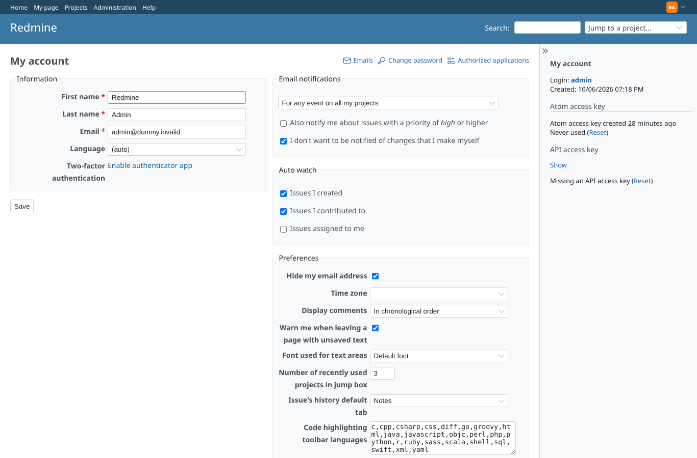 | admin | `/my/account` | /my/account (HTTP 200) |
| 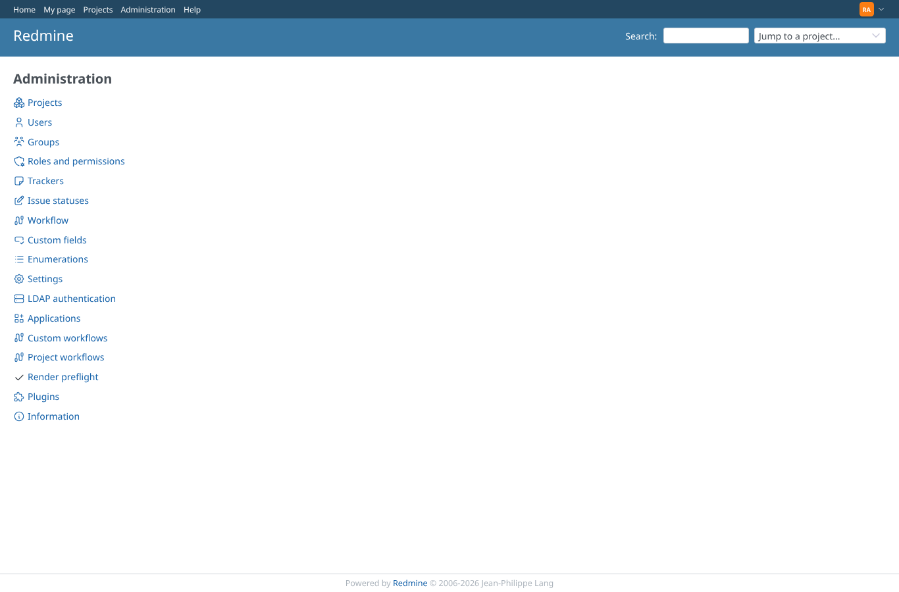 | admin | `/admin` | /admin (HTTP 200) |
| 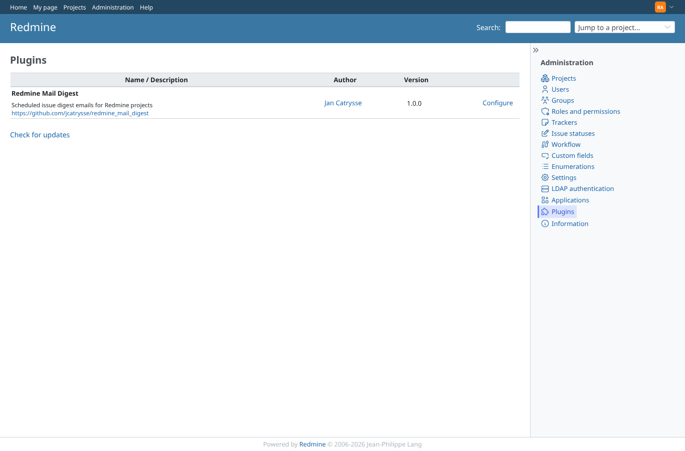 | admin | `/admin/plugins` | /admin/plugins (HTTP 200) |
| 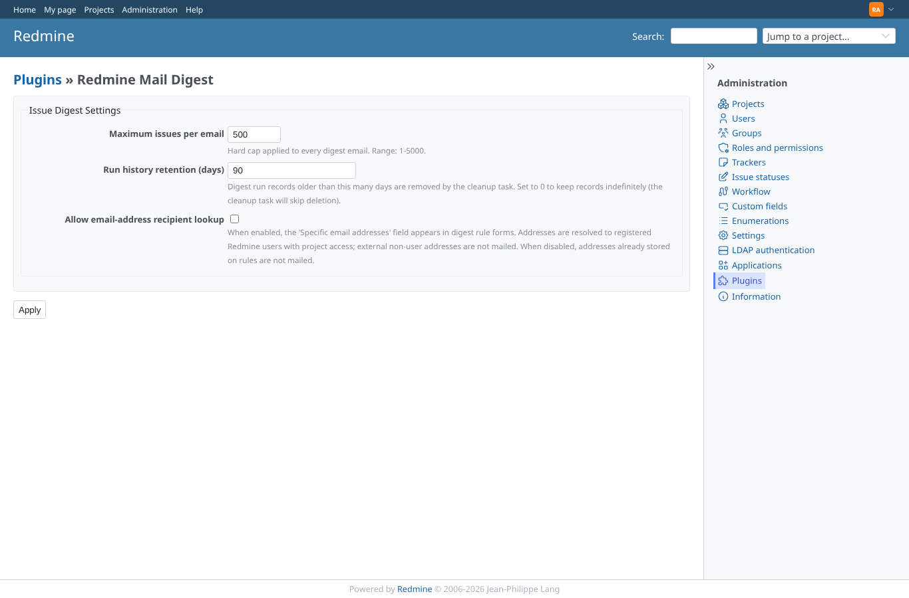 | admin | `/settings/plugin/redmine_mail_digest` | /settings/plugin/redmine_mail_digest (HTTP 200) |
| 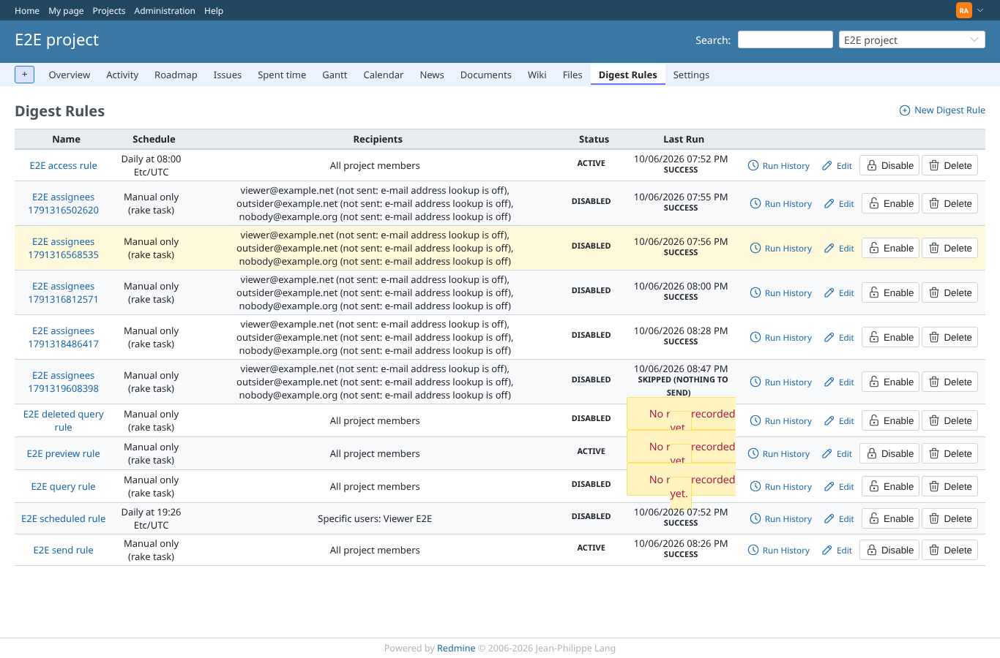 | admin | `/projects/e2e-project/digest_rules` | /projects/e2e-project/digest_rules (HTTP 200) |
| 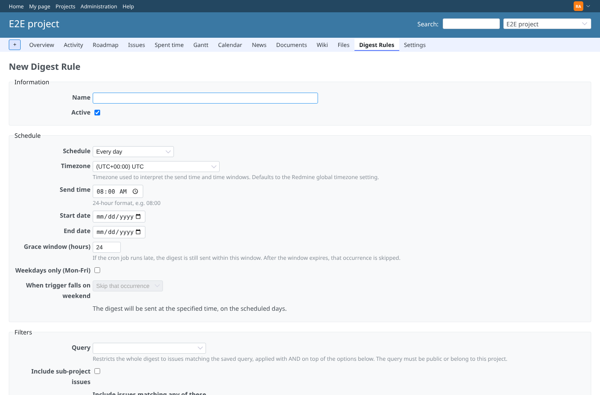 | admin | `/projects/e2e-project/digest_rules/new` | /projects/e2e-project/digest_rules/new (HTTP 200) |
| 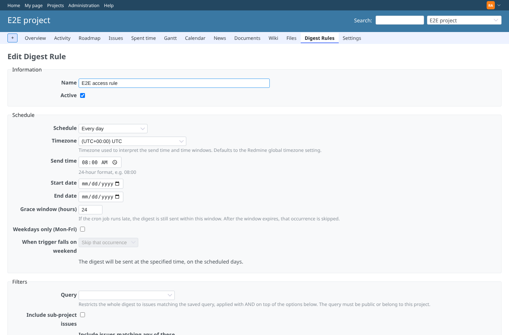 | admin | `/projects/e2e-project/digest_rules/1/edit` | /projects/e2e-project/digest_rules/1/edit (HTTP 200) |
| 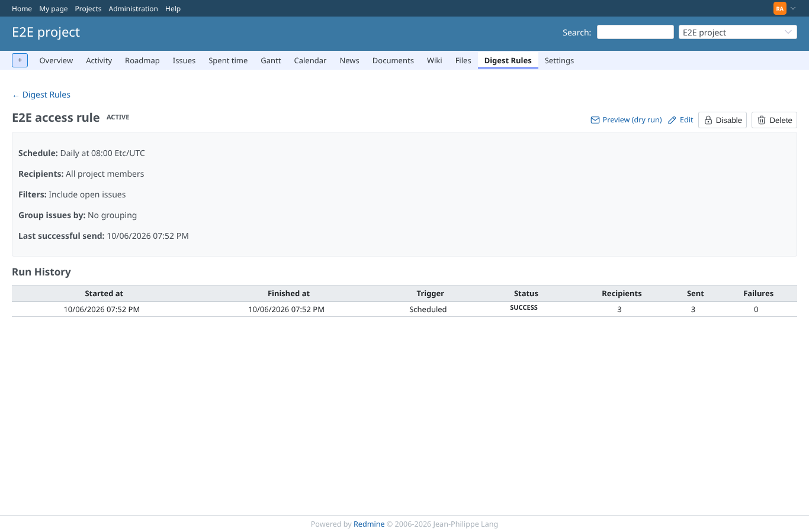 | admin | `/projects/e2e-project/digest_rules/1` | /projects/e2e-project/digest_rules/1 (HTTP 200) |
