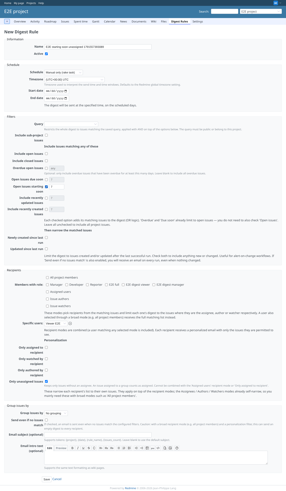
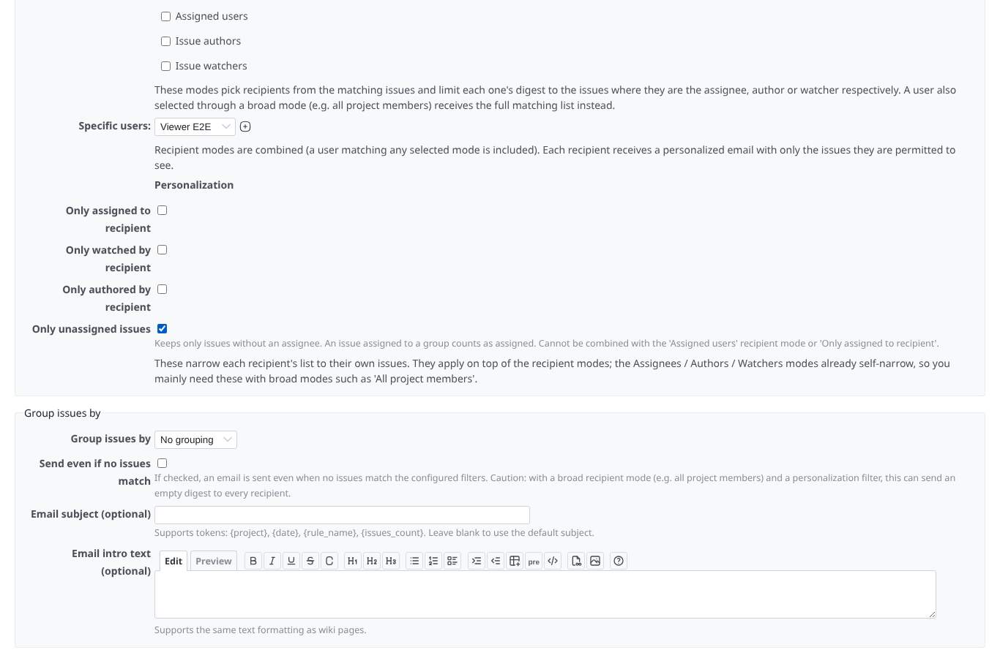
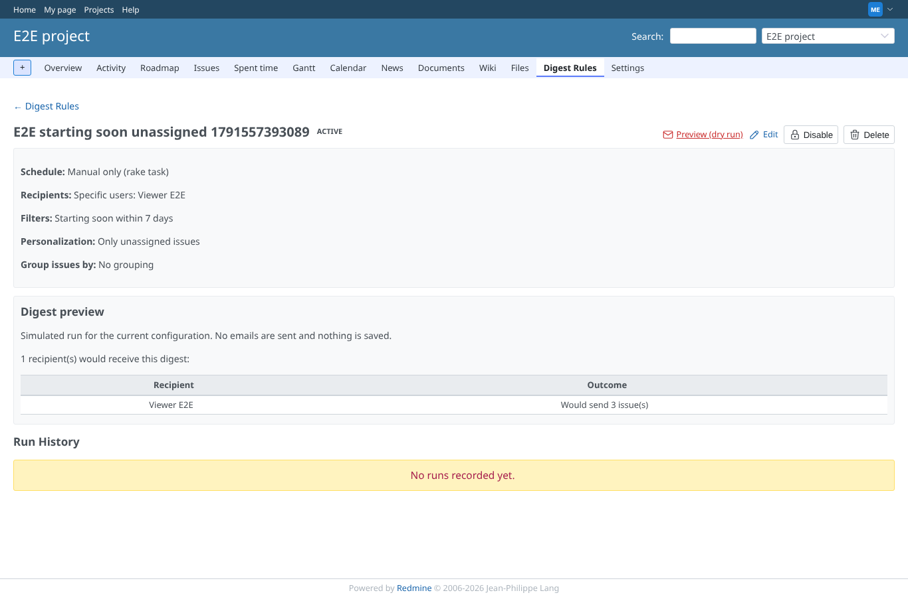
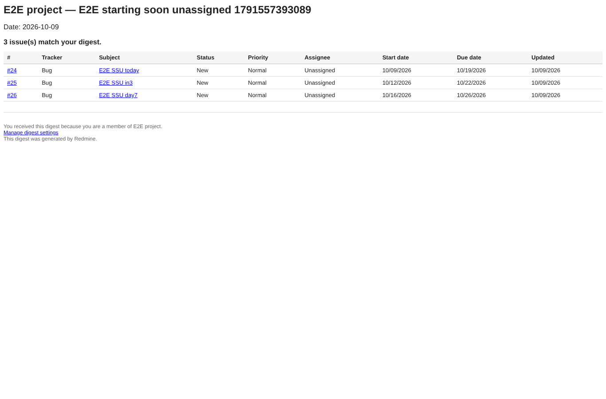
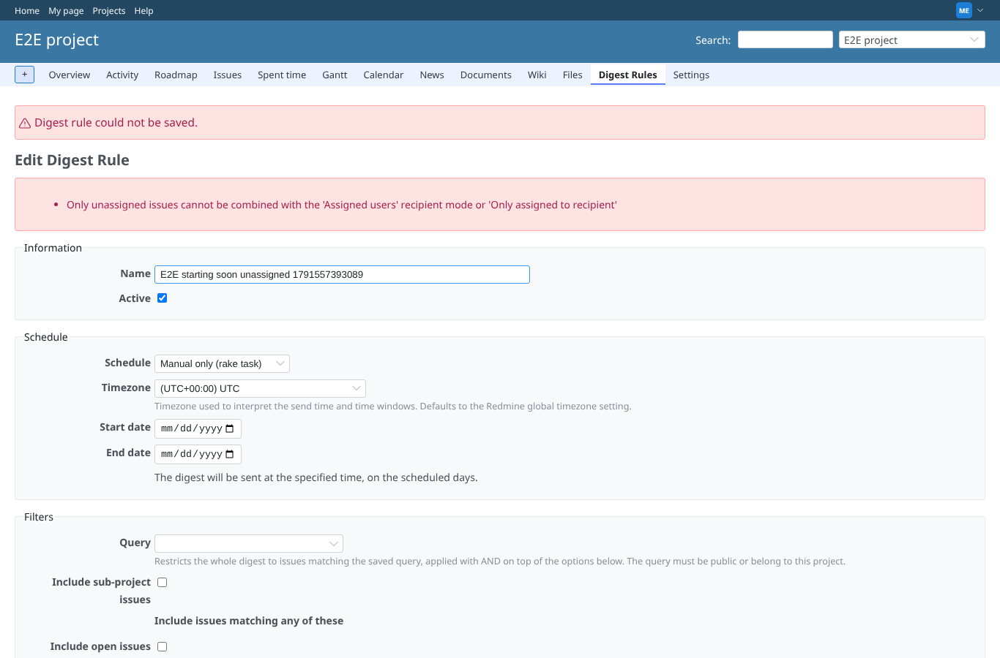
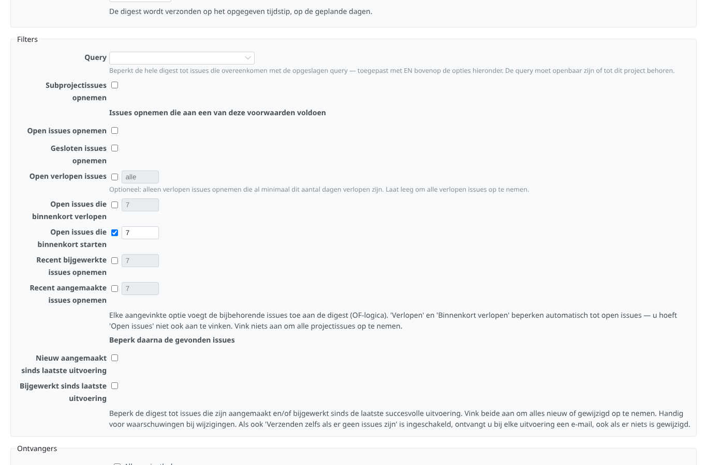

# starting-soon-unassigned

Run 2026-10-09T14:50:47.161Z against http://127.0.0.1:3000.

| screenshot | user | URL | shows |
|---|---|---|---|
|  | manager | `/projects/e2e-project/digest_rules/new` | New rule: "Open issues starting soon" ticked with 7 days (field enabled by its checkbox), open issues off, schedule manual |
|  | manager | `/projects/e2e-project/digest_rules/new` | Same form: recipient one specific user (Viewer E2E), "Only unassigned issues" ticked with its hint |
|  | manager | `/projects/e2e-project/digest_rules/2` | Rule page: filters "Starting soon within 7 days", personalization "Only unassigned issues", recipient Viewer E2E; dry run: Viewer E2E Would send 3 issue(s) |
|  | manager | `/projects/e2e-project/digest_rules/2` | The mail to Viewer E2E as a mail client shows it: only the unassigned open issues starting today, in 3 and in 7 days, with the Start date column |
|  | manager | `/projects/e2e-project/digest_rules/2` | Refused: "Only unassigned issues" with the "Assigned users" recipient mode: Only unassigned issues cannot be combined with the 'Assigned users' recipient mode or 'Only assigned to recipient' |
|  | manager | `/projects/e2e-project/digest_rules/2` | Refused: "Only unassigned issues" with "Only assigned to recipient": Only unassigned issues cannot be combined with the 'Assigned users' recipient mode or 'Only assigned to recipient' |
|  | manager | `/projects/e2e-project/digest_rules/2/edit` | The edit form in Dutch: Open issues die binnenkort starten, Alleen niet-toegewezen issues |
|  | reporter | `/projects/e2e-project/digest_rules/new` | reporter (no plugin permissions): the new rule form is refused (403) |
